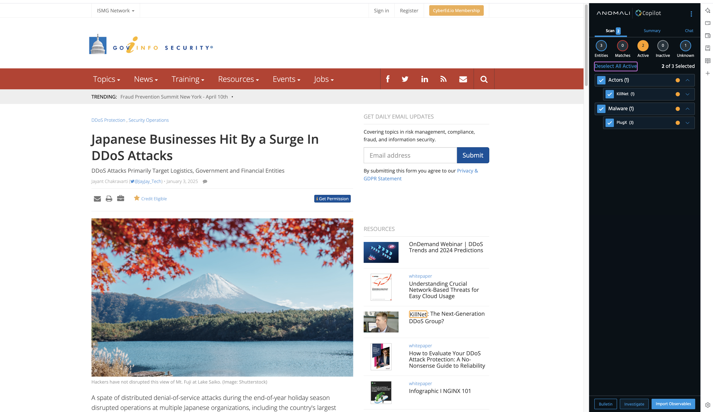

# Getting started with Anomali Copilo
Anomali Copilot gives you AI-Powered Visibility for Security, IT, and Fraud Detection. The objective of the RM here is to get started Anomali Copilot with your ThreatStream organization withing 15min!
 
 

## Prerequisite
You have Chrome browser, and have already signed-in your ThreatStreat organization with the browser. If you don't have your ThreatStream account, contact with your [Anomali representatives](https://www.anomali.com/contact).
 
 

## Getting started!
Install [Copilot chrome extension](https://chromewebstore.google.com/detail/anomali-copilot/ghmbpcmonklliphfbkdbedkdkilfbngm) on your browser.
 
Visit a sample security articles that has some IoCs(e.g. domain, IP, malware), and scan it with Copilot. I'm scanning [an article](https://www.govinfosecurity.com/japanese-businesses-hit-by-surge-in-ddos-attacks-a-27216) that tells us that majority Japanese financial sector customers have been impacted with huge DDoS attacks.
 

 
 

I have found 2 active observables that are active on my ThreatStream - let's check **Select All Active** and hit **Investigate**. 
 

 
 

Hit **Create Investigation** - it will create an investigation on your ThreatStream.
 

 
 

On my investigation, I can identify TTPs gaps that must be improved so that I can tacle this specific attack. For now, I don't have any defense capabilities that could be suitable with the TTPs!
 

 
 

#  Issue Reporting
If you have found a bug or if you have updates request, please report them at this repository issues section.
